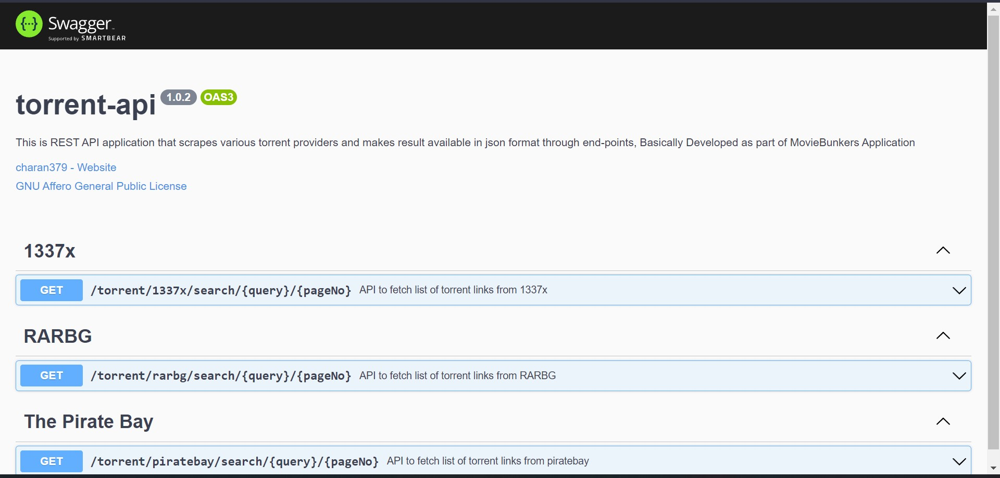

# torrent-api :magnet:

[](https://github.com/charan379/torrent-api)    [](https://github.com/charan379/torrent-api) [](https://www.gnu.org/licenses/agpl-3.0.en.html)


This is REST API application that scrapes various torrent providers and makes result available in json format through end-points, Basically Developed as part of  MovieBunkers Application


## Environment Variables

To run this project, you will need to add the following environment variables to your .env file

`PORT`  

This is optional if not provided applicatoin will start running on port 3000 by default

####  Example 
`PORT`=3001 

## Run

Clone the project

```bash
  git clone https://github.com/charan379/torrent-api
```

Go to the project directory

```bash
  cd torrent-api
```
Add Environment Variables then
Install dependencies

```bash
  npm install
```

Start the server

```bash
  npm run start
```

Server will start running on given port

## Supported Torrents
#### Following is the list of supports torrent scrappers by torrent-api

| Torrent | API End Point     | Status   |
| :-------- | :------- | :------------------------- |
| `1337x` | `GET` [`/torrent/1337x/search/{query}/{pageNo}`](#get-1337x-search) | **:green_circle:** |
| `RARBG` | `GET` [`/torrent/rarbg/search/{query}/{pageNo}`](#get-rarbg-search) | **:green_circle:**: |
| `ThePirateBay` | `GET` [`/torrent/piratebay/search/{query}/{pageNo}`](#get-the_pirate_bay-search) | **:green_circle:** |

## API Reference

### GET 1337x search
#### Retirve list of torrent links from 1337x based on given query

```bash
  GET /torrent/1337x/search/{query}/{pageNo}
```

| Path Parameter | Type     | Description                |
| :-------- | :------- | :------------------------- |
| `query` | `string` | **Required**. query like movie, tv show or a file name |
| `pageNo` | `number` | page number |

#### Example
```bash
  GET /torrent/1337x/search/matrix%201999/1
```
### GET RARBG search
#### Retirve list of torrent links from rarbg based on given query

```bash
  GET /torrent/rarbg/search/{query}/{pageNo}
```

| Path Parameter | Type     | Description                |
| :-------- | :------- | :------------------------- |
| `query` | `string` | **Required**. query like movie, tv show or a file name |
| `pageNo` | `number` | page number |

#### Example
```bash
  GET /torrent/rarbg/search/matrix%201999/1
```

### GET The_Pirate_Bay search
#### Retirve list of torrent links from piratebay based on given query

```bash
  GET /torrent/piratebay/search/{query}/{pageNo}
```

| Path Parameter | Type     | Description                |
| :-------- | :------- | :------------------------- |
| `query` | `string` | **Required**. query like movie, tv show or a file name |
| `pageNo` | `number` | page number |

#### Example
```bash
  GET /torrent/piratebay/search/matrix%201999/1
```

### Post-Installation
#### Swagger Documentation
```bash
    http://localhost:PORT/api-docs
````


## Authors

- [@charan379](https://www.github.com/charan379)

## License

[](https://www.gnu.org/licenses/agpl-3.0.en.html)
